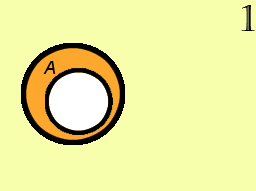
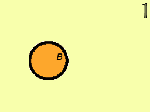
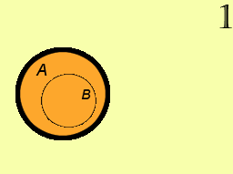
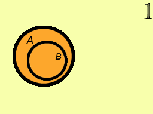
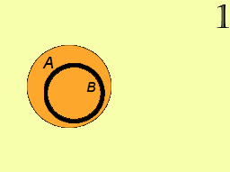
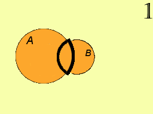
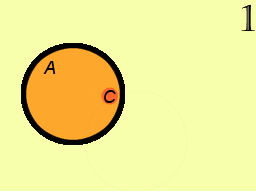
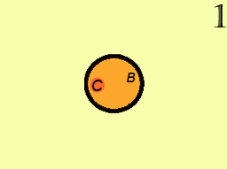
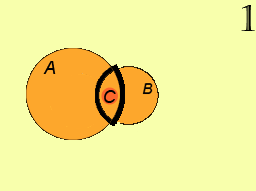

# Множества и работа с ними

Задание:

а. A + B = (A - B) + (B - A).

б. C ⊃ (A ∪ B), если C ⊃ A, C ⊃ B

## Решение

### Часть а

A:

B:

А + В:

А – В:

В – А:

(А – В) + (В – А):

### Часть б

A ∪ B:

C ⊃ A:

C ⊃ B:

C ⊃ (A ∪ B):

